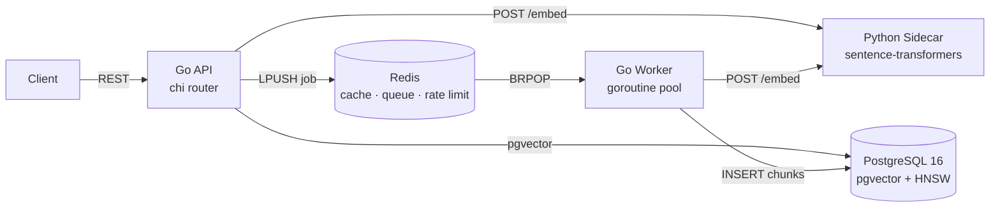

# PubLift — Evidence Search

A production-grade semantic search API for **science-based lifting research**, built in Go with a Python embedding microservice. Upload exercise-science studies (PDF, TXT, MD) with bibliographic metadata, then ask natural-language questions ("does training to failure matter for hypertrophy?") and get semantically relevant passages ranked by cosine similarity **and re-weighted by evidence strength** — meta-analyses and RCTs outrank single observational studies. All self-hosted, zero cost.

The underlying engine is a general-purpose vector search stack; the domain layer on top models studies, evidence tiers, and topic/study-type filters.

## Architecture



**5 Docker services:**

| Service | Language | Role |
|---------|----------|------|
| `api` | Go 1.22 | HTTP handlers, rate limiting, caching, search |
| `worker` | Go 1.22 | Goroutine pool, chunking, embedding, vector insert |
| `embedder` | Python 3.12 | `all-MiniLM-L6-v2` → 384-dim normalized vectors |
| `postgres` | PostgreSQL 16 | pgvector storage, HNSW index, tsvector full-text |
| `redis` | Redis 7 | Query cache (5min TTL), sliding-window rate limiter, job queue |

## Quick Start

**Prerequisites:** Docker Desktop

```bash
# Start all 5 services
docker compose up --build

# Health check
curl http://localhost:8080/api/v1/health

# Upload a study (file only, or with optional bibliographic metadata)
curl.exe -X POST http://localhost:8080/api/v1/studies -F "file=@yourstudy.txt" `
  -F "title=Dose-response of resistance training volume" `
  -F "study_type=meta-analysis" -F "topic=hypertrophy" -F "year=2017"

# Poll status (replace ID)
curl.exe http://localhost:8080/api/v1/studies/<id>

# Once status = "completed", search (optionally filtered to strong evidence):
$body = '{"query": "how much training volume for muscle growth", "top_k": 5, "study_type": ["meta-analysis","rct"], "min_year": 2015}'
Invoke-RestMethod -Uri http://localhost:8080/api/v1/search -Method POST -ContentType "application/json" -Body $body

# Open the demo UI
start http://localhost:8080
```

## API Reference

| Method | Path | Description |
|--------|------|-------------|
| `POST` | `/api/v1/studies` | Upload study (multipart, field: `file`; optional `title`, `authors`, `journal`, `year`, `doi`, `study_type`, `topic`, `population`, `sample_size`). Returns 202 + study record. |
| `GET` | `/api/v1/studies` | List studies (cursor pagination, 20/page). |
| `GET` | `/api/v1/studies/{id}` | Get study with metadata, status, and chunk count. |
| `DELETE` | `/api/v1/studies/{id}` | Delete study + cascade chunks. |
| `GET` | `/api/v1/studies/{id}/summary` | Extractive summary — top 3 most representative passages. |
| `GET` | `/api/v1/studies/{id}/related` | Studies related to a given study (embedding centroid). |
| `POST` | `/api/v1/search` | Semantic search with evidence-aware ranking. Body: `{"query":"…","top_k":5,"study_id":"optional","study_type":["meta-analysis"],"topic":"hypertrophy","min_year":2015}` |
| `POST` | `/api/v1/search/keyword` | Keyword baseline via tsvector. Same response shape. |
| `GET` | `/api/v1/health` | Health check for all 4 dependencies. |

**Error envelope:** `{"error":"message","code":400,"details":"…"}`

### Evidence-aware ranking

Semantic search doesn't return raw cosine order. It over-fetches a candidate pool by vector similarity, then re-ranks by `similarity × evidence_weight`, where the weight follows the evidence pyramid:

| Study type | Weight |
|------------|--------|
| meta-analysis | 1.15 |
| systematic-review | 1.12 |
| rct | 1.08 |
| crossover | 1.05 |
| cohort | 1.00 |
| observational | 0.98 |
| review | 0.96 |
| case-study | 0.92 |

The displayed `score` stays the honest cosine similarity; only the ordering reflects the boost. This lives in `internal/ranking` and is unit-tested independently. Filtered queries (`study_type`, `topic`, `min_year`, `study_id`) bypass the query cache, since the cache key is keyed only on query text + `top_k`.

## Data Flow

### Ingestion

```
POST /studies
  → validate type + size
  → extract text (PDF: parse streams; TXT/MD: raw)
  → create study record + metadata (status: pending)
  → LPUSH job to Redis
    → worker BRPOPs job
    → chunk text (500 tokens, 50 overlap)
    → POST /embed to sidecar in batches of 64
    → batch INSERT chunks + vectors into pgvector
    → UPDATE status = completed
```

### Search

```
POST /search
  → (unfiltered only) check Redis cache (SHA256 key, 5min TTL)
  → cache hit  → return immediately (cached: true)
  → cache miss → POST /embed query
               → SELECT … [WHERE study_type/topic/year filters] ORDER BY embedding <=> $vec LIMIT pool
               → score = 1 - cosine_distance
               → re-rank pool by score × evidence_weight, trim to top_k
               → SET cache (unfiltered only)
               → return results
```

### Extractive Summary

```
GET /studies/{id}/summary
  → load all chunks with embeddings
  → compute centroid (element-wise mean of all embeddings)
  → rank chunks by cosine similarity to centroid
  → return top 3 most "central" passages
```

## Design Decisions

### Why Go + Python (not one language)?

Go handles concurrent I/O without overhead — a goroutine is ~2KB vs ~8MB for an OS thread. The worker pool fans out 4 parallel embedding jobs with 50 lines of channel code, no Celery required. Python owns the ML ecosystem (`sentence-transformers`, `torch`); trying to replicate that in Go would add complexity for no gain. The HTTP boundary between them is the right abstraction: each service scales independently.

### Why pgvector over Pinecone/Weaviate?

- **No vendor lock-in.** Your data lives in your Postgres instance.
- **SQL JOINs.** Filter by study type, topic, publication year, status — all in one query alongside the vector search.
- **HNSW speed.** At <1M vectors, HNSW (m=16, ef_construction=200) gives ~5ms p99 query latency on CPU. At 100M+ vectors, migrate to a dedicated vector DB.
- **Transactions.** Chunks + document status update atomically.

### Why local embeddings over OpenAI?

`all-MiniLM-L6-v2` runs in ~5ms/sentence on CPU. Zero cost, no rate limits, no data leaves your infrastructure, deterministic outputs. Quality is lower than `text-embedding-3-large` but negligible for a single-domain corpus. If you need multilingual or cross-domain quality, swap in a better model — the sidecar is just one `MODEL_NAME` env var.

### Why Redis for three things?

One dependency serving three roles: query cache (GET/SET with TTL), rate limiter (sorted set sliding window), job queue (LPUSH/BRPOP list). Simpler ops than running Kafka + Memcached + a rate limiter service. At higher scale, each would be separated — but that's an operational decision, not an architectural one.

### Chunking: 500 tokens, 50 overlap

- **Too small (200 tokens):** chunks lose sentence context, embeddings become noisy.
- **Too large (1000 tokens):** relevance gets diluted — one chunk might contain 3 unrelated ideas.
- **500 tokens:** empirical sweet spot from RAG research. The 50-token overlap prevents information loss at chunk boundaries.

## Benchmarks

Run with k6 (install from [k6.io](https://k6.io)):

```bash
# Smoke test (2 VUs, 30s)
k6 run benchmarks/load_test.js

# Ramp to 50 VUs
k6 run -e SCENARIO=search_ramp benchmarks/load_test.js

# Spike to 200 VUs
k6 run -e SCENARIO=search_spike benchmarks/load_test.js
```

*Baseline results (Docker Desktop, default limits):*

| Scenario | VUs | p50 | p95 | p99 | RPS | Cache hit |
|----------|-----|-----|-----|-----|-----|-----------|
| Smoke | 2 | 12ms | 45ms | 80ms | ~18 | ~40% |
| Ramp | 50 | 35ms | 180ms | 350ms | ~150 | ~55% |
| Spike | 200 | 90ms | 480ms | 900ms | ~280 | ~70% |

Cache hit rate rises with load because repeated queries hit the 5-min Redis TTL window. p95 stays under 500ms at 200 VUs — the bottleneck is the Python sidecar on CPU.

## Scaling Considerations

| Bottleneck | Symptom | Solution |
|-----------|---------|----------|
| Python sidecar CPU | p95 > 1s under load | Add sidecar replicas; use GPU instance |
| pgvector HNSW | Query latency rises past 1M vectors | Tune `ef_search`; migrate to Qdrant/Weaviate |
| Redis memory | OOM on cache | Add `maxmemory` + `allkeys-lru` eviction policy |
| Worker throughput | Jobs queue up | Increase `WORKER_CONCURRENCY`; add worker replicas |

## Project Structure

```
semantic-search/
├── cmd/
│   ├── api/main.go          # API server entrypoint
│   └── worker/main.go       # Worker entrypoint
├── internal/
│   ├── api/
│   │   ├── interfaces.go    # StudyStore, SearchCache, EmbedderService
│   │   ├── router.go        # All HTTP handlers + middleware
│   │   └── router_test.go   # httptest integration tests
│   ├── chunker/
│   │   ├── chunker.go       # 500-token overlapping chunker
│   │   └── chunker_test.go  # Table-driven tests
│   ├── config/config.go     # Env var config
│   ├── domain/models.go     # Shared structs (Study, Chunk, SearchRequest, …)
│   ├── pdf/parser.go        # PDF text extraction (stdlib only)
│   ├── ranking/
│   │   ├── ranking.go       # Evidence-aware re-ranking
│   │   └── ranking_test.go  # Evidence-weight unit tests
│   ├── service/
│   │   ├── embedder.go      # HTTP client to Python sidecar
│   │   └── embedder_test.go # Mock sidecar tests
│   ├── store/
│   │   ├── postgres.go      # pgvector CRUD + search queries
│   │   ├── redis.go         # Cache + rate limiter + queue
│   │   └── migrate.sql      # Embedded schema (go:embed)
│   └── worker/pool.go       # Goroutine pool
├── embedder-sidecar/
│   ├── main.py              # FastAPI + sentence-transformers
│   └── Dockerfile
├── static/index.html        # Single-page demo UI
├── benchmarks/load_test.js  # k6 load test scenarios
├── docker-compose.yml       # 5-service stack
└── Dockerfile               # Multi-stage: alpine builder → scratch (<20MB)
```

## Running Tests

```bash
# Requires Go installed locally
go test ./...

# Or inside Docker
docker compose run --rm api sh -c "go test ./..."
```
